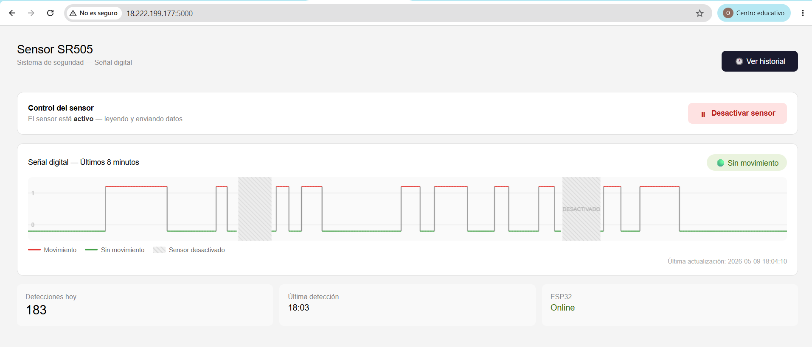
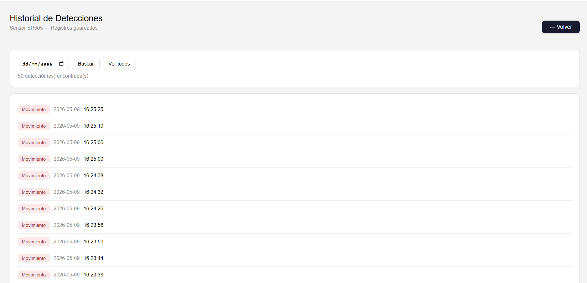

# Sistema de Seguridad con Sensor SR505 + ESP32 + AWS

**Alumno:** Oscar David Barrientos Huillca - 225419

Sistema IoT de monitoreo de movimiento en tiempo real. El ESP32 lee el sensor PIR SR505 y envía los datos vía WiFi a un servidor Flask en AWS EC2, donde se almacenan en PostgreSQL y se visualizan en una interfaz web con gráfico de señal digital.

---

## Interfaz Web



> Gráfico de señal digital en tiempo real — rojo = movimiento detectado, verde = sin movimiento, gris rayado = sensor desactivado.

---

## Estructura del Proyecto

```
Apagar-Prender-AWS/
├── platformIO/               # Proyecto PlatformIO (firmware ESP32)
│   ├── src/
│   │   └── main.cpp          # Código fuente del ESP32
│   └── platformio.ini        # Configuración de la placa y framework
│
└── sensor_proyecto/          # Servidor Flask (AWS EC2)
    ├── app.py                # API REST principal
    └── templates/
        ├── index.html        # Página principal con gráfico
        └── historial.html    # Página de historial de detecciones
```

---

## Arquitectura del Sistema

```
SR505 → ESP32 (WiFi) ──HTTP POST──▶ Flask (EC2) ──▶ PostgreSQL
                  ▲                      │
                  │  GET /estado_control  │
                  └──────────────────────┘
                                         │
                     Navegador ◀── HTML/JSON
```

| Capa | Tecnología |
|---|---|
| Hardware | ESP32 WROOM-32 + Sensor SR505 |
| Firmware | C++ con Arduino Framework (PlatformIO) |
| Backend | Python 3.12 + Flask |
| Base de datos | PostgreSQL 14 |
| Servidor | AWS EC2 Ubuntu 24.04 |
| Protocolo | HTTP REST sobre WiFi |

---

## Conexión del Hardware


| Pin SR505 | Pin ESP32 | Función |
|---|---|---|
| VCC | VIN (5V) | Alimentación |
| GND | GND | Tierra |
| OUT | GPIO13 | Señal digital |

> El LED integrado en **GPIO2** se enciende cuando hay movimiento detectado. Al desactivar el sensor desde la web, el LED se apaga completamente.

---

## Endpoints de la API

| Endpoint | Método | Descripción |
|---|---|---|
| `/` | GET | Página principal con gráfico |
| `/historial` | GET | Página de historial |
| `/sensor` | POST | Recibe datos del ESP32 |
| `/estado` | GET | Estado actual en JSON |
| `/historial_json` | GET | Lista de detecciones (filtrable por fecha) |
| `/conteo_hoy` | GET | Total de detecciones del día |
| `/control` | POST | Enciende o apaga el sensor |
| `/estado_control` | GET | Estado actual del control (usado por el ESP32) |
| `/señal` | GET | Timestamps de detecciones por fecha |

---

## Control del Sensor (ON/OFF)

La interfaz web incluye un botón para activar o desactivar el sensor remotamente. Al desactivarlo:

- El ESP32 consulta `/estado_control` cada 5 segundos
- Si el servidor responde `sensor_activo: false`, el ESP32 **deja de leer el pin, apaga el LED y no envía datos**
- El servidor ignora cualquier dato que llegue mientras el sensor esté desactivado
- El gráfico muestra una **zona gris rayada** durante el período desactivado, distinguiéndolo claramente del estado "sin movimiento"

### Flujo de control

```
Botón web ──POST /control?accion=apagar──▶ Flask (sensor_activo = False)
                                                │
ESP32 ──GET /estado_control (c/5s)──▶ {"sensor_activo": false}
                                                │
                              LED apagado, sin lecturas, sin envíos
```

### Dependencia adicional en el firmware

El archivo `platformio.ini` debe incluir la librería ArduinoJson:

```ini
[env:esp32dev]
platform = espressif32
board = esp32dev
framework = arduino
monitor_speed = 115200
lib_deps =
    bblanchon/ArduinoJson @ ^6.21.3
```

> **Nota:** El estado del sensor (activo/inactivo) se guarda en memoria RAM del servidor. Si el servicio Flask se reinicia, el sensor vuelve a estar activo automáticamente.

---

## Historial de Detecciones



Página separada accesible desde el botón **Ver historial**. Permite filtrar detecciones por fecha y muestra el total de registros encontrados.

---

## Instalación y Despliegue

### Requisitos del servidor (EC2)
- Ubuntu 24.04 LTS
- Python 3.12+
- PostgreSQL 14+
- Puerto 5000 abierto en el Security Group

### 1. Preparar el entorno en EC2

```bash
sudo apt update
sudo apt install python3-full python3-venv postgresql -y
sudo timedatectl set-timezone America/Lima

mkdir ~/sensor_proyecto && cd ~/sensor_proyecto
mkdir templates
python3 -m venv venv
source venv/bin/activate
pip install flask psycopg2-binary
```

### 2. Configurar PostgreSQL

```bash
sudo -u postgres psql -c "CREATE DATABASE sensordb;"
sudo -u postgres psql -c "CREATE USER sensoruser WITH PASSWORD 'tu_password';"
sudo -u postgres psql -c "GRANT ALL PRIVILEGES ON DATABASE sensordb TO sensoruser;"
sudo -u postgres psql -d sensordb -c "GRANT ALL ON SCHEMA public TO sensoruser;"
```

### 3. Configurar el servicio systemd

Crear `/etc/systemd/system/sensor.service`:

```ini
[Unit]
Description=Sensor SR505 Flask App
After=network.target

[Service]
User=ubuntu
WorkingDirectory=/home/ubuntu/sensor_proyecto
Environment="PATH=/home/ubuntu/sensor_proyecto/venv/bin"
ExecStart=/home/ubuntu/sensor_proyecto/venv/bin/python3 app.py
Restart=always

[Install]
WantedBy=multi-user.target
```

```bash
sudo systemctl daemon-reload
sudo systemctl enable sensor
sudo systemctl start sensor
```

### 4. Configurar el firmware (ESP32)

En `platformIO/src/main.cpp` editar estas líneas:

```cpp
const char* ssid       = "TU_WIFI";
const char* password   = "TU_PASSWORD";
const char* serverUrl  = "http://TU_IP_EC2:5000/sensor";
const char* controlUrl = "http://TU_IP_EC2:5000/estado_control";
```

Luego en PlatformIO: **Build** → **Upload**.

---

## 🛠️ Comandos útiles

```bash
# Ver estado del servicio
sudo systemctl status sensor

# Ver logs en tiempo real
journalctl -u sensor -f

# Reiniciar servicio
sudo systemctl restart sensor

# Ver últimas detecciones en la BD
sudo -u postgres psql -d sensordb -c \
  "SELECT * FROM detecciones ORDER BY id DESC LIMIT 10;"

# Limpiar tabla de detecciones
sudo -u postgres psql -d sensordb -c \
  "TRUNCATE TABLE detecciones RESTART IDENTITY;"
```

---

## Características

- Gráfico de señal digital en tiempo real (últimos 8 minutos)
- Zona gris rayada en el gráfico durante períodos con sensor desactivado
- Control remoto del sensor desde la interfaz web (ON/OFF)
- El ESP32 reacciona al control remoto sin necesidad de reprogramarse
- Registro de detecciones con timestamp en hora peruana
- Historial consultable con filtro por fecha
- Mecanismo anti-rebote (cooldown de 5 segundos)
- Servicio systemd para disponibilidad continua

---

## Limitaciones conocidas

- La comunicación no usa HTTPS (sin cifrado)
- No hay autenticación de usuarios
- El gráfico se reinicia al recargar la página (datos en memoria)
- El estado ON/OFF del sensor se pierde si Flask se reinicia
- Flask corre en modo desarrollo (no apto para alta concurrencia)
- El ESP32 tarda hasta 5 segundos en reaccionar al cambio de estado (intervalo de consulta)